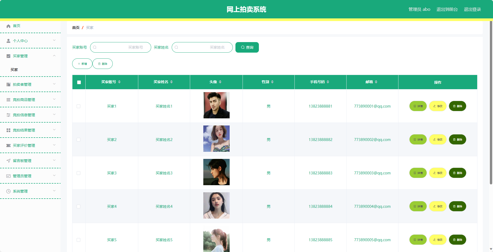
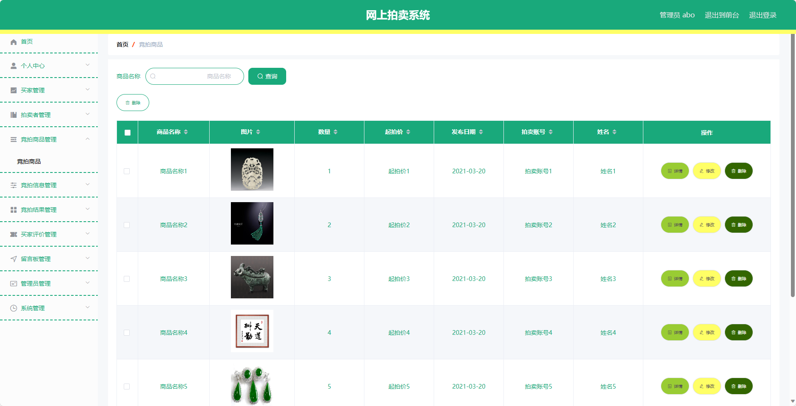

## 基于SSM框架实现的网上拍卖系统(程序+报告)

- <b>完整代码获取地址：从戎源码网 ([https://armycodes.com/](https://armycodes.com/))</b>
- <b>技术探讨、资料分享，请加QQ群：692619798</b> 
- <b>作者微信：19941326836  QQ：952045282</b> 
- <b>承接计算机毕业设计、Java毕业设计、Python毕业设计、深度学习、机器学习</b>
- <b>选题+开题报告+任务书+程序定制+安装调试+论文+答辩ppt 一条龙服务</b>
- <b>所有选题地址 ([https://github.com/YuLin-Coder/AllProjectCatalog](https://github.com/YuLin-Coder/AllProjectCatalog)) </b>

## 项目介绍
基于SSM框架实现的网上拍卖系统，系统包含两种角色：管理员、用户,系统分为前台和后台两大模块，主要功能如下。

前台功能简介：
1. 首页：展示网站的主要内容和推荐拍卖商品，方便用户快速浏览和导航。
2. 竞拍商品：展示各类拍卖商品的详细信息，包括商品图片、起拍价、竞拍倒计时等，用户可以参与竞拍并提交竞拍价格。
3. 留言反馈：提供给用户发表意见和建议的平台，用户可以对商品或网站进行留言反馈，以便改进和优化用户体验。
4. 个人中心：用户可以在个人中心查看和管理自己的个人信息，包括竞拍记录、拍卖结果、买家评价等。

后台功能简介：
用户：
1. 个人中心：用户可以在个人中心查看和管理自己的个人信息，包括修改密码、查看权限等。
2. 竞拍信息管理：用户可以查看自己参与的竞拍信息，包括拍卖商品、竞拍价格等。
3. 竞拍结果管理：用户可以查看自己的竞拍结果，包括拍卖成功与否以及成交价格等。
4. 买家评价管理：用户可以对拍卖成功的商品进行评价。
5. 留言板管理：用户可以查看和管理自己在留言板上的留言。

管理员：
1. 个人中心：管理员可以在个人中心查看和管理自己的个人信息，包括修改密码、查看权限等。
2. 买家管理：管理员可以对用户进行管理，包括查看用户信息、禁用用户、重置密码等。
3. 拍卖者管理：管理员可以对拍卖者进行管理，包括审核拍卖者、管理拍卖者信息等。
4. 竞拍商品管理：管理员可以对拍卖商品进行管理，包括添加、编辑和删除拍卖商品。
5. 竞拍信息管理：管理员可以对竞拍信息进行管理，包括查看用户的竞拍信息、审核竞拍结果等。
6. 竞拍结果管理：管理员可以查看和管理用户的拍卖结果，包括确认成交、生成订单等。
7. 买家评价管理：管理员可以对买家的评价进行管理，包括查看评价、删除评价等。
8. 留言板管理：管理员可以对留言板进行管理，包括查看留言、删除留言等。
9. 管理员管理：管理员可以对其他管理员进行管理，包括添加、编辑和删除管理员。
10. 系统管理：管理员可以对系统进行管理，包括设置网站基本信息、备份数据库等。

拍卖者：
1. 个人中心：拍卖者可以在个人中心查看和管理自己的个人信息，包括修改密码、查看权限等。
2. 竞拍商品管理：拍卖者可以对拍卖商品进行管理，包括添加、编辑和删除拍卖商品。
3. 竞拍信息管理：拍卖者可以对竞拍信息进行管理，包括查看用户的竞拍信息、审核竞拍结果等。
4. 竞拍结果管理：拍卖者可以查看和管理用户的拍卖结果，包括确认成交、生成订单等。
5. 买家评价管理：拍卖者可以对买家的评价进行管理，包括查看评价、删除评价等。

## 项目技术
- 编程语言：Java
- 数据库：MySQL
- 前端技术：JSP、HTML、Jquery、Bootstrap
- 后端技术：Spring、SpringMVC、MyBatis

## 运行环境
- JDK版本：JDK1.8及以上
- 开发工具：IDEA、Ecplise、Myecplise都可以
- 数据库: MySQL5.7及以上

## 运行截图

